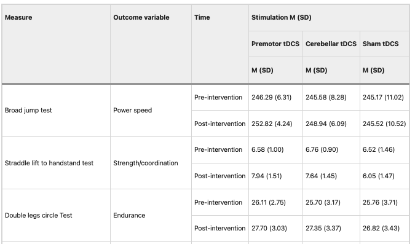

*clipr* is a function that makes it possible to interact with the clipboard through R code. This script shows you how to read in and reformat a table that has means and SDs merged in cells, so that you end up with a column for means and one for SDs.

IMPORTANT: because this script reads information from your clipboard, you have to make sure you have got the correct information on the clipboard before you run it. The last chunk requires you to copy a new column onto the clipboard before you run it.

When developing this code I frequently got weird results, and this was because I'd forgotten that I'd copied something new onto the clipboard!

```{r setup, include=FALSE}
knitr::opts_chunk$set(echo = TRUE)
require(clipr)
require(stringr)
clipr_available()  #checks if clipboard available to write to, but we are only reading
```

I've found it particularly good for dealing with published tables that I want to analyse.

The first example comes from here: <https://www.nature.com/articles/s41598-023-37843-1>. We are interested in Table 3, (<https://www.nature.com/articles/s41598-023-37843-1/tables/3>); Here's a screenshot of the first part of the table.



I want to get these data into .csv format for R wrangling. With *clipr* you can read in tabular data that has been copied onto the clipboard. However, it only works with tabular data where there is a consistent format of rows and columns. If there is any merged material, as in this example, it won't work.

So we start by copying onto the clipboard the main body of the table, ignoring the two merged columns on the left, and the merged material in the shaded rows. Copying onto the clipboard while avoiding merged material can be difficult, and may require some experimentation with intermediate steps. For instance, with this table, I copied the whole table from the website onto the clipboard and then pasted into Word using "Paste and Match Formatting" to preserve the original table structure. It was then possible to select just the body of the table and copy that onto the clipboard, for transfer to R.

```{r readdata}
mytab<- read_clip_tbl(header=F)
#no header this time; if there is a header row, then header = T.
str(mytab) #to view what we have read in
```

This is a good start, as we have a data frame with the correct data. However, the data is currently formatted as strings, with the SD in brackets attached to the means. We want to separate that out.

We first make a new table with a duplicate of each column, side by side. (This is clunky code that could definitely be streamlined better!).

```{r maketab2}
ncol <- ncol(mytab)
mycols<-1:ncol
mytab2 <- cbind(mytab,mytab) #first duplicate 
#then reorder so same columns next to each other
nucols <- paste(mycols,(mycols+ncol),sep=',',collapse=',') #list of reordered columns
#have to fiddle with this to make it numeric
temp2 <- unlist(strsplit(nucols, ","))
temp2a <- as.numeric(temp2)
#now reorder columns in my tab2
mytab2 <- mytab2[,temp2a]
head(mytab2) #just to inspect our handiwork.

```

Next we want to split each cell at the separator - in this case it's an open bracket, but you can use other separators.

```{r splitcols}

mysep <- "\\("  #if SDs in brackets #default  ; need double backslash for bracket 

# mysep <- "±"  #another option - this doesn't need double backslash


mytab3 <- mytab2
for (i in seq(3,ncol(mytab2),2)){
  for (j in 1:nrow(mytab2)){
    temp <- unlist(strsplit(mytab2[j,i],mysep))
    temp2 <- gsub("\\)", "",temp) #remove close bracket
    #temp2 has the separate values for before and after the separator
  mytab3[j,i]<-str_trim(temp2[1]) #remove white space
  mytab3[j,(i+1)]<-str_trim(temp2[2]) #remove white space
  }
}  #all OK except they are strings!

for (i in 3:ncol(mytab3)){
  mode(mytab3[,i])<-'numeric'
}
```

Now we label the columns

```{r tidyup}


nunames <- expand.grid(c('Mean','SD'), c('Premotor','Cerebellar','Sham'))
nunames2 <- paste0(nunames[,2],nunames[,1])
names(mytab3)[3:ncol(mytab3)]<-nunames2
names(mytab3)[1] <- 'timing'


```

To add the details of task, we can again use read_clip_tbl, this time copying on to the clipboard the left-most column of the original table.

NB COPY LABELS COLUMN ON TO CLIPBOARD BEFORE RUNNING THIS CHUNK!!

```{r addnames}
mytab<- read_clip_tbl(header=F)

#because of the merging, we have only 8 values, and we need 16

mytasks <- rep(mytab$V1,each=2)

mytab3[,1] <-mytasks #substitute task name for column 1

#You can now save your new file
myname <- 'gymdata.csv'
write.csv(mytab3,myname,row.names=F)

```
